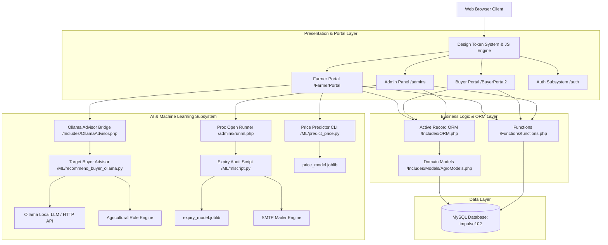
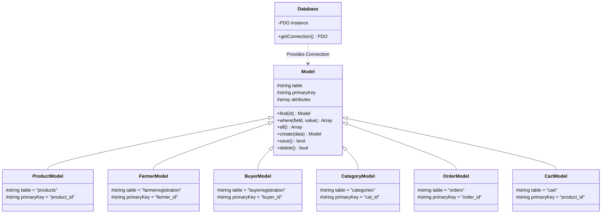
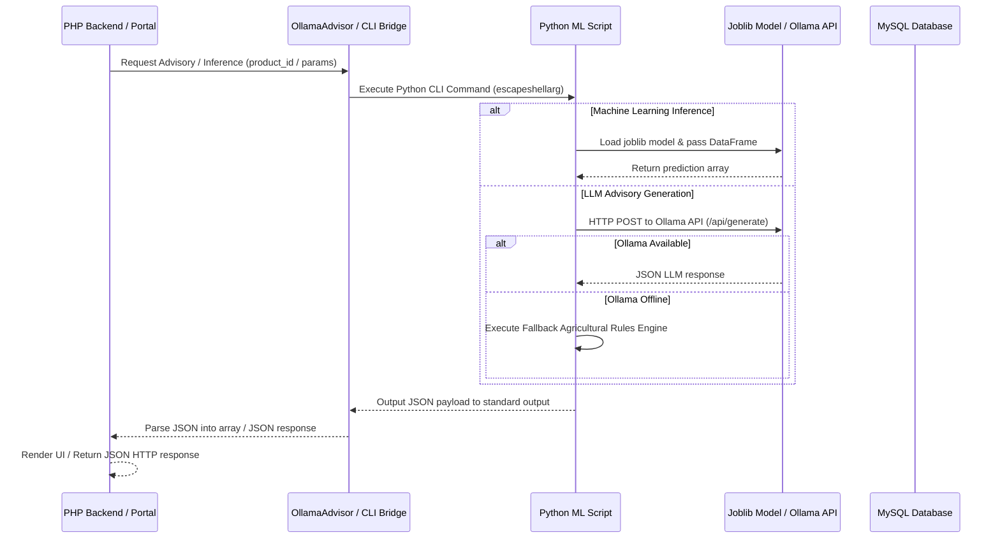
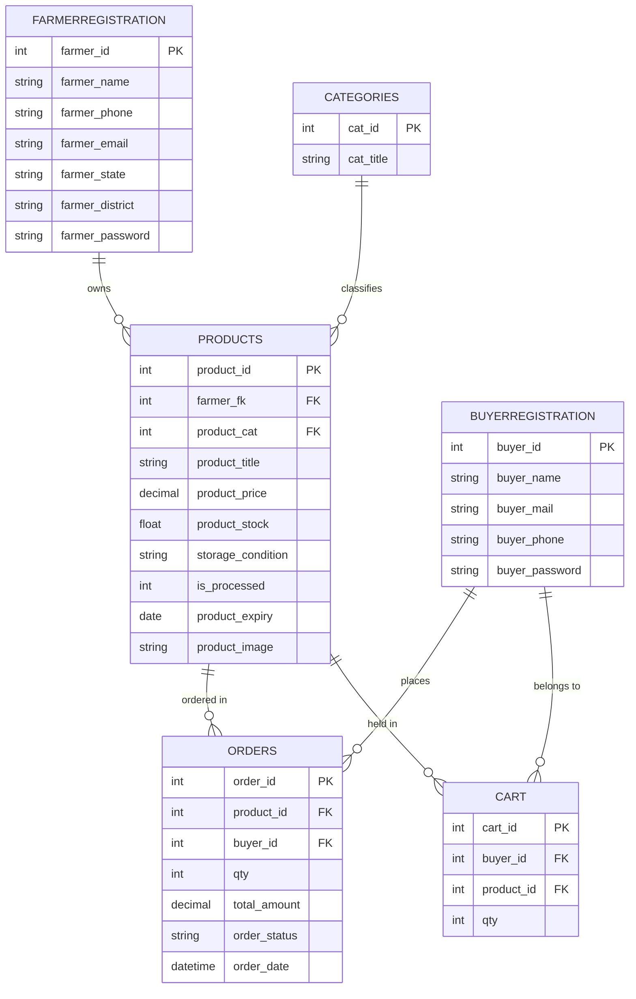

# AgroNGO System Architecture

## Architectural Overview

AgroNGO is a direct farm-to-consumer digital marketplace platform with integrated machine learning and artificial intelligence capabilities. The platform connects agricultural producers (farmers) directly with commercial and individual buyers, eliminating intermediary exploitation and improving price transparency.

The platform architecture is built around three core pillars:
1. Multi-Portal Presentation Layer: Dedicated interfaces tailored for Farmers, Buyers, and System Administrators.
2. Hybrid Data Access Layer: Procedural PHP business logic combined with an Active Record Object-Relational Mapping (ORM) framework built on PHP Data Objects (PDO).
3. Machine Learning & Intelligent Advisory Engine: Python-based inference scripts for produce shelf-life estimation, dynamic market price recommendations, and automated target buyer advisory services.

---

## High-Level Architecture Diagram

---

## Component Architecture

### 1. Presentation & Design Token System

The frontend interface relies on a centralized design system built without heavy client-side frameworks, maximizing load speed and rendering performance.

- Design Tokens (`Styles/agronogo-design.css`): Defines color palettes using HSL CSS variables, custom glassmorphic surface styles, typography parameters using Google Fonts (Inter and Outfit), button variants, input controls, and CSS keyframe animations.
- Component Engine (`Styles/agronogo-components.js`): Provides interactive client-side behaviors including scroll-triggered entry animations, toast notifications (`AgroToast`), sticky header elevation, password display toggles, interactive quantity controls, and modal backdrop handlers.
- Reusable Navigation Modules (`Includes/components/navbar.php` and `Includes/components/footer.php`): Exposes standard PHP functions `agro_navbar()` and `agro_footer()` to maintain layout consistency across all portals.

### 2. User Portals & Subsystems

#### Farmer Portal (`/FarmerPortal`)
Designed for agricultural producers to manage inventory and monitor fulfillment operations.
- Product Lifecycle Management: Facilities to create, update, and remove produce listings (`InsertProduct.php`, `EditProduct.php`, `MyProducts.php`).
- AI Pricing Assistant: Integrates real-time price estimation during product creation using input parameters like crop category, storage method, processing state, location, and stock volume.
- Order Management: Visual status pipeline for tracking customer orders from placement to fulfillment (`Orders.php`).
- Financial Records: Transaction logs and historical sales records (`Transactions.php`).
- Target Buyer Advisory: Interactive endpoint that analyzes produce freshness and recommends bulk commercial buyers (`api_buyer_recommendation.php`).

#### Buyer Portal (`/BuyerPortal2`)
Provides an e-commerce marketplace for retail and commercial produce procurement.
- Catalog Exploration: Search and filtering mechanisms by category, state, and district (`bhome.php`, `products.php`, `StateSearch.php`, `DistrictSearch.php`).
- Product Detail Inspection: Multi-panel view detailing produce condition, harvest date, farmer credentials, and fulfillment options (`productdetails.php`).
- Cart & Checkout Subsystem: Session-backed shopping cart management with instant quantity adjustment (`cartpage.php`, `AddQty.php`, `MinusQty.php`) and checkout processing supporting cash on delivery and digital payments (`checkout.php`).
- Saved Items: Secondary storage area for deferred purchasing decisions (`saveforlater.php`).

#### Admin Panel (`/admins`)
Administrative suite for system oversight and operational control.
- Dashboard & Analytics: High-level overview of platform traffic, active listings, registered users, and total transaction volume (`dashboard.php`).
- User Management: Account management for farmers and buyers (`manage-users.php`).
- Inventory Oversight: Quality moderation and auditing of produce listings (`manage-products.php`).
- Order Oversight: Platform-wide fulfillment tracking (`manage-orders.php`).
- AI Expiry Console: Real-time execution terminal for batch shelf-life audits and email notification dispatch (`runml.php`).

#### Authentication Subsystem (`/auth`)
- Shared authentication mechanisms for Farmers, Buyers, and Administrators (`FarmerLogin.php`, `BuyerLogin.php`, `FarmerRegister.php`, `BuyerRegistration.php`).
- Password Security: Employs custom AES-128-CTR encryption routines utilizing OpenSSL primitives to ensure credential protection.

---

## Business Logic & Data Access Layer

The backend uses a dual-pattern architecture combining traditional procedural database helper functions with an Active Record Object-Relational Mapping (ORM) pattern.

### Active Record ORM (`Includes/ORM.php`)
- `Database`: Singleton PDO instance provider enforcing UTF-8 character encoding, exception mode error handling, and prepared statement emulation settings.
- `Model`: Base abstract Active Record class implementing generic CRUD operations (`find`, `where`, `all`, `create`, `save`, `delete`).
- `Domain Models` (`Includes/Models/AgroModels.php`): Concrete implementations mapping application models (`ProductModel`, `FarmerModel`, `BuyerModel`, `CategoryModel`, `OrderModel`, `CartModel`) to corresponding MySQL tables.

---

## AI & Machine Learning Subsystem

The AI subsystem operates via CLI script wrappers called directly from PHP runtime environments using shell execution and process pipes.

### 1. Produce Expiry Horizon Model (`ML/models/expiry_model.joblib`)
- Model Type: Random Forest Regressor trained using Scikit-Learn.
- Training Data: `ML/GFG1_realistic.csv` containing botanical decay profiles.
- Features: Produce category, storage environment (Ambient, Cold Storage, Refrigerated), and processing state.
- Execution Context: Utilized during automated inventory audits (`ML/mlscript.py`) to estimate remaining shelf life.

### 2. Dynamic Price Recommendation Model (`ML/models/price_model.joblib`)
- Script: `ML/predict_price.py`
- Features: Crop item name, category ID, storage condition, processing state, state location, stock quantity, and delivery option.
- Output: Recommended price per kilogram along with estimated upper and lower market bounds.
- Fallback Mechanism: Heuristic calculation matrix active if the model file is unreadable or missing.

### 3. Target Buyer Advisory Engine (`ML/recommend_buyer_ollama.py`)
- PHP Wrapper: `Includes/OllamaAdvisor.php`
- HTTP Endpoint: `FarmerPortal/api_buyer_recommendation.php`
- Integration: Queries a local Ollama instance hosting the `llama3` model for structured JSON buyer recommendations.
- Rule Engine Fallback: Embedded domain-specific agricultural decision rules for identifying suitable commercial buyer channels (e.g., juice vendors, pulp processors, bakeries, sauce manufacturers) based on decay stage.

### 4. Automated Expiry Audit & Email Dispatcher (`ML/mlscript.py`)
- Administration Interface: `admins/runml.php`
- Execution: Uses `proc_open` to execute the audit asynchronously while streaming stdout to an administrative web console.
- Workflow: Iterates through active produce listings, evaluates predicted vs. actual expiry dates, identifies short shelf-life inventory (0-5 days remaining), fetches farmer contact information, and dispatches HTML clearance deal alerts to registered buyers via SMTP.

---

## Database Architecture & Schemas

The application relies on a MySQL relational database (`impulse102`). Below is the schema layout for the primary entities.

---

## Security Architecture

1. Credential Encryption:
   - User passwords are encrypted prior to storage using custom AES-128-CTR routines via PHP OpenSSL extension functions (`openssl_encrypt`/`openssl_decrypt`).

2. SQL Injection Prevention:
   - Database queries in the ORM layer (`Includes/ORM.php`) strictly use PDO prepared statements with bound parameters.
   - Legacy functions in `Functions/functions.php` sanitize inputs using parameter casting and string escaping.

3. Process Execution Security:
   - CLI arguments passed from PHP to Python scripts are sanitized using `escapeshellarg()` to prevent shell injection vulnerabilities.

4. Session & Access Control:
   - Session checks enforce authentication across portal domains (`$_SESSION['farmer_login']`, `$_SESSION['buyer_login']`, `$_SESSION['alogin']`).

---

## Infrastructure & Deployment Model

- Operating System: Windows / Linux cross-compatible.
- Web Server: Apache 2.4+ (typically deployed via XAMPP stack).
- Database Server: MySQL 5.7+ / MariaDB 10.4+.
- PHP Runtime: PHP 8.0 or higher with extensions enabled (`pdo`, `pdo_mysql`, `openssl`, `mysqli`).
- Python Environment: Python 3.8+ with virtualenv support containing `scikit-learn`, `pandas`, `numpy`, `joblib`, `pymysql`, and `python-dotenv`.
